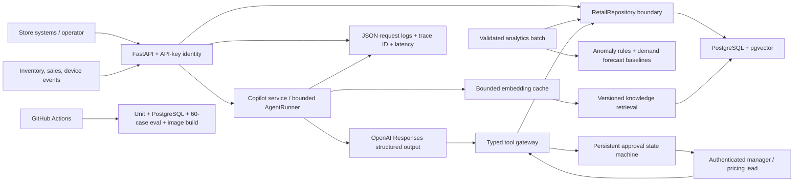

# Architecture

## Trust boundaries

- The model never writes directly to PostgreSQL. It can only request a named, schema-validated
  tool call.
- Inventory adjustments and price changes requested by the Agent are persisted as pending
  approvals. Execution requires a server-resolved API-key identity with an allowed role.
- Direct operations writes require a server-resolved role and persist an actor audit event in the
  same transaction as the business mutation. Audit queries are admin-only.
- Generated citations are checked against the exact knowledge chunks and tool results available in
  that run. Invented citation IDs fail the request.
- PostgreSQL constraints and idempotency keys remain the final defense against invalid or repeated
  writes.
- A context-local request ID propagates from HTTP middleware through model attempts and tool calls,
  allowing one request to be reconstructed from JSON events without logging tool arguments or API
  secrets.

## Runtime paths

The local path uses Docker Compose with a pgvector-enabled PostgreSQL container. The cloud blueprint
uses the same application image, a managed Render PostgreSQL instance, an Alembic pre-deploy gate,
and deterministic knowledge ingestion. The API can run without an OpenAI key for retrieval and
extractive cited answers; the live multi-step Agent intentionally returns 503 when no model provider
is configured.

## Known boundaries

- The offline hashing embedder is lexical and English-oriented. It is a deterministic development
  baseline, not a production semantic-retrieval model.
- The 60-case suite exercises deterministic retrieval, citation, tool, and policy contracts. It
  does not yet measure a live LLM's answer quality because no API key is available in this runtime.
- The separate 12-case live Agent suite is executable but has no recorded result until an authorized
  API key is configured.
- API keys are a deliberately narrow portfolio identity boundary, not an enterprise identity
  platform. Production use still needs managed identity, rotation, service-account scopes, and an
  external append-only audit sink.
